# Contoh Output — 3.1 Alur Penelitian

> **Catatan penggunaan:** Ini adalah contoh draf siap-pakai untuk subbab 3.1.
> Ganti `[PERLU DILENGKAPI]` dengan informasi aktual dari penelitian Anda.
> Diagram dibuat dengan Mermaid (render otomatis di GitHub dan tools Markdown modern).

---

## 3.1 Alur Penelitian

Penelitian ini mengikuti kerangka *Software Development Life Cycle* (SDLC) sebagai tulang punggung metodologinya. Pemilihan SDLC bukan sekadar konvensi — ia sekaligus menjadi objek penelitian itu sendiri, karena setiap fasenya menjadi arena pengujian sejauh mana arsitektur multi-agen berbasis keahlian (*Skill-Based AI*) dapat mengotomatisasi pekerjaan rekayasa perangkat lunak secara nyata. Dengan kata lain, peneliti tidak hanya *mengikuti* SDLC, tapi juga *mengamati* bagaimana agen-agen AI berperforma di setiap tahapnya.

Secara keseluruhan, penelitian ini terbagi menjadi tujuh fase yang berjalan secara sekuensial, dengan ketergantungan dokumen yang eksplisit — output satu fase menjadi input bagi fase berikutnya. Tidak semua fase melibatkan AI agen. Fase awal (Perencanaan dan sebagian Analisis) dilakukan secara manual oleh peneliti, sementara fase inti pengembangan (Desain, Implementasi, dan Pengujian) sepenuhnya dijalankan oleh agen-agen AI di bawah koordinasi *Thin Orchestrator*. Dua fase lain bersifat *hybrid*, menggabungkan penggunaan alat bantu AI (*AI tool*) dengan proses manual.

Gambar 3.1 berikut menggambarkan alur penelitian secara keseluruhan, lengkap dengan keterangan fase mana yang menggunakan AI agen (warna biru solid), mana yang dilakukan secara manual tanpa AI agen (warna abu-abu), dan mana yang bersifat *hybrid* menggunakan alat bantu AI namun bukan melalui sistem agen yang diteliti (warna ungu).

---

### Gambar 3.1 — Diagram Alur Penelitian INSPIRA (SDLC)

```mermaid
flowchart TD
    classDef aiAgent   fill:#1D4ED8,stroke:#1E40AF,color:#ffffff,font-weight:bold
    classDef noAgent   fill:#D1D5DB,stroke:#9CA3AF,color:#374151,font-weight:bold
    classDef hybrid    fill:#7C3AED,stroke:#6D28D9,color:#ffffff,font-weight:bold
    classDef outputDoc fill:#F9FAFB,stroke:#D1D5DB,color:#6B7280,font-style:italic
    classDef terminal  fill:#111827,stroke:#111827,color:#ffffff,font-weight:bold

    %% ── TERMINAL ──────────────────────────────────────────────
    START([🚀 Mulai Penelitian]):::terminal

    %% ── FASE 1: PLANNING ──────────────────────────────────────
    subgraph FASE1["⬜ FASE 1 · PLANNING — Tanpa AI Agen"]
        direction TB
        P1A[Studi literatur proses bisnis Hak Cipta via DJKI]:::noAgent
        P1B[Demo pengajuan permohonan Hak Cipta secara langsung]:::noAgent
        P1C[Observasi sistem HKI Universitas Indonesia via screen recording]:::noAgent
        P1D[Pencatatan kebutuhan awal dan alur proses bisnis]:::noAgent
        P1A --> P1B --> P1C --> P1D
    end

    OUT1[/"📄 Output: Catatan Kebutuhan Awal · Business Process Document"/]:::outputDoc

    %% ── FASE 2: ANALYSIS & REQUIREMENTS ──────────────────────
    subgraph FASE2["🔷 FASE 2 · ANALYSIS & REQUIREMENTS — Hybrid"]
        direction TB
        P2A["2a. Pembuatan desain prototype INSPIRA\n    dengan Figma Make (Claude Sonnet 4.5)\n    — teknik artifact-based requirement gathering"]:::hybrid
        P2B["2b. User interview staf PPKI Universitas Pertamina\n    — pendekatan semi-terstruktur, open-ended questions"]:::noAgent
        P2C["2c. Kompilasi Master Context Document\n    (desain Figma + kode React.tsx + transcript wawancara\n    + business process)"]:::hybrid
        P2A --> P2B --> P2C
    end

    OUT2[/"📄 Output: Prototype UI Figma · Kode React.tsx Awal\nTranscript Wawancara · Master Context Document"/]:::outputDoc

    %% ── FASE 3: DESIGN ────────────────────────────────────────
    subgraph FASE3["🔵 FASE 3 · DESIGN — Dengan AI Agen"]
        direction TB
        P3O["🎯 Thin Orchestrator Agent\n— menerima trigger, merutekan ke agen yang tepat"]:::aiAgent
        P3A["Agent RE\n→ Analisis kebutuhan sistem\n→ Prioritisasi dengan WSJF/AHP"]:::aiAgent
        P3B["Agent Architecture\n→ Perancangan arsitektur sistem\n→ Generate C4 Model, UML, ERD, API Spec"]:::aiAgent
        P3V["✅ Validasi Ahli Domain\n(evaluasi berbasis ISO/IEC 25010)"]:::noAgent
        P3O --> P3A & P3B --> P3V
    end

    OUT3[/"📄 Output: Software Requirements Specification (SRS · IEEE 830)\nArchitecture Diagram (C4/UML) · ERD · API Specification"/]:::outputDoc

    %% ── FASE 4: IMPLEMENTATION ────────────────────────────────
    subgraph FASE4["🔵 FASE 4 · IMPLEMENTATION — Dengan AI Agen"]
        direction TB
        P4O["🎯 Thin Orchestrator Agent"]:::aiAgent
        P4A["Agent Code\n→ Generate kode fungsional INSPIRA\n   (tracking revisi, dashboard, manajemen dokumen)\n→ Kode frontend, backend, dan basis data"]:::aiAgent
        P4V["✅ Validasi Ahli Domain"]:::noAgent
        P4O --> P4A --> P4V
    end

    OUT4[/"📄 Output: Source Code Fungsional · Dokumentasi Inline"/]:::outputDoc

    %% ── FASE 5: TESTING ───────────────────────────────────────
    subgraph FASE5["🔵 FASE 5 · TESTING — Dengan AI Agen"]
        direction TB
        P5O["🎯 Thin Orchestrator Agent"]:::aiAgent
        P5A["Agent Testing\n→ Generate test case dan test script\n→ Eksekusi pengujian (unit, end-to-end, composable)\n→ Penyusunan laporan pengujian"]:::aiAgent
        P5V["✅ Validasi Ahli Domain"]:::noAgent
        P5O --> P5A --> P5V
    end

    OUT5[/"📄 Output: Software Test Report (IEEE 829 / ISO/IEC 29119)"/]:::outputDoc

    %% ── FASE 6: DEPLOYMENT ────────────────────────────────────
    subgraph FASE6["⬜ FASE 6 · DEPLOYMENT — Tanpa AI Agen"]
        direction TB
        P6A["Deploy prototype INSPIRA ke environment staging/production"]:::noAgent
        P6B["Verifikasi sistem dapat diakses oleh pengguna"]:::noAgent
        P6A --> P6B
    end

    OUT6[/"📄 Output: Functional Prototype (Website INSPIRA)"/]:::outputDoc

    %% ── FASE 7: MAINTENANCE & KNOWLEDGE TRANSFER ─────────────
    subgraph FASE7["🔷 FASE 7 · MAINTENANCE & KNOWLEDGE TRANSFER — Hybrid"]
        direction TB
        P7A["Kompilasi INSPIRA Skill Library\n(folder: elicitation · documentation · validation)"]:::hybrid
        P7B["Penyusunan Procedural Knowledge Document\n(Markdown files — transferable learning untuk model AI masa depan)"]:::hybrid
        P7A --> P7B
    end

    OUT7[/"📄 Output: INSPIRA Skill Library · Procedural Knowledge Document"/]:::outputDoc
    FINISH([🏁 Selesai]):::terminal

    %% ── ALUR UTAMA ────────────────────────────────────────────
    START --> FASE1 --> OUT1 --> FASE2 --> OUT2 --> FASE3 --> OUT3
    OUT3    --> FASE4 --> OUT4 --> FASE5 --> OUT5
    OUT5    --> FASE6 --> OUT6 --> FASE7 --> OUT7 --> FINISH

    %% ── LEGENDA ───────────────────────────────────────────────
    subgraph LEGENDA["📌 Legenda"]
        direction LR
        L1["🔵 Menggunakan AI Agen"]:::aiAgent
        L2["⬜ Tanpa AI Agen"]:::noAgent
        L3["🔷 Hybrid (AI Tool / Manual)"]:::hybrid
    end
```

---

### Penjelasan Diagram

Alur di atas mengalir dari atas ke bawah secara sekuensial, di mana setiap kotak *output* (berbingkai abu-abu muda) menandai perpindahan antar fase. Berikut penjelasan ringkas untuk masing-masing fase:

**Fase 1 — Planning** dilakukan seluruhnya secara manual oleh peneliti. Pada fase ini, peneliti mengumpulkan pemahaman mendalam tentang proses bisnis pendaftaran Hak Cipta di Indonesia — mulai dari membaca regulasi dan dokumentasi resmi DJKI, mencoba langsung proses pengajuan permohonan sebagai simulasi pengguna, hingga mengamati antarmuka sistem serupa yang sudah berjalan di Universitas Indonesia. Seluruh temuan ini dicatat sebagai bahan dasar bagi fase berikutnya.

**Fase 2 — Analysis & Requirements** bersifat *hybrid*. Ada tiga sub-tahap yang berjalan: pertama, peneliti menggunakan Figma Make (sebuah *AI tool* berbasis Claude Sonnet 4.5) untuk menghasilkan desain prototipe antarmuka INSPIRA melalui teknik *artifact-based requirement gathering* — di sini AI digunakan sebagai alat bantu desain, bukan sebagai agen dalam sistem yang diteliti. Kedua, peneliti melakukan wawancara semi-terstruktur dengan staf PPKI Universitas Pertamina untuk memvalidasi desain dan menggali kondisi nyata di lapangan. Ketiga, semua artefak yang terkumpul — desain Figma, kode React.tsx awal, transkrip wawancara, dan catatan proses bisnis — dikompilasi menjadi satu *Master Context Document* yang akan menjadi fondasi bagi seluruh agen AI di fase berikutnya.

**Fase 3 — Design** adalah fase pertama di mana sistem multi-agen berbasis keahlian mulai aktif. *Thin Orchestrator Agent* menerima *Master Context Document* sebagai input dan merutekannya secara selektif kepada dua agen: *Agent RE* yang menganalisis kebutuhan dan menghasilkan *Software Requirements Specification* (SRS) sesuai standar IEEE 830, serta *Agent Architecture* yang menerjemahkan SRS tersebut ke dalam berbagai diagram arsitektur. Seluruh output agen pada fase ini dievaluasi oleh ahli domain menggunakan rubrik berbasis ISO/IEC 25010.

**Fase 4 — Implementation** mengandalkan *Agent Code* yang menerima SRS dan diagram arsitektur dari Fase 3 sebagai konteks, lalu menghasilkan kode fungsional lengkap untuk sistem INSPIRA. Kode yang dihasilkan mencakup fitur-fitur utama seperti *dashboard* pengajuan, sistem *tracking* revisi, dan manajemen dokumen, dan dievaluasi kembali oleh ahli domain sebelum diteruskan ke fase berikutnya.

**Fase 5 — Testing** dijalankan oleh *Agent Testing* yang menerima *source code* dari Fase 4 dan menghasilkan rangkaian pengujian — mulai dari *test case*, *test script*, hingga laporan pengujian yang terstruktur sesuai standar IEEE 829 atau ISO/IEC 29119. Sama seperti fase-fase sebelumnya, hasil agen divalidasi oleh ahli domain sebelum dinyatakan final.

**Fase 6 — Deployment** kembali dilakukan secara manual, mencakup proses *deploy* prototipe ke lingkungan *staging* atau *production* sehingga sistem INSPIRA dapat diakses dan diuji coba oleh pengguna nyata.

**Fase 7 — Maintenance & Knowledge Transfer** bersifat *hybrid*. Pada fase ini, peneliti mengompilasi seluruh *skill* yang telah digunakan dan dikembangkan selama penelitian menjadi *INSPIRA Skill Library* — sebuah repositori pengetahuan prosedural terstruktur yang tersimpan dalam format Markdown dan dapat dipelajari oleh model AI generasi berikutnya (*transferable learning*). Fase ini memastikan bahwa pengetahuan yang terakumulasi selama penelitian tidak hilang, melainkan terdokumentasikan dengan baik sebagai aset jangka panjang.

---

### Tabel Ringkasan Fase dan Penggunaan AI

| Fase | Nama Fase | Jenis | Agen/Alat yang Terlibat | Output Utama |
|:---:|---|:---:|---|---|
| 1 | Planning | ⬜ Manual | — | Business Process Document |
| 2a | Analysis — Desain UI | 🔷 Hybrid | Figma Make (AI Tool) | Prototype Figma + React.tsx |
| 2b | Analysis — Validasi | ⬜ Manual | User Interview | Transcript Wawancara |
| 2c | Analysis — Fondasi | 🔷 Hybrid | Peneliti + Kompilasi | Master Context Document |
| 3 | Design | 🔵 AI Agen | Orchestrator + Agent RE + Agent Architecture | SRS (IEEE 830), Architecture Diagram, ERD |
| 4 | Implementation | 🔵 AI Agen | Orchestrator + Agent Code | Source Code Fungsional |
| 5 | Testing | 🔵 AI Agen | Orchestrator + Agent Testing | Software Test Report (IEEE 829) |
| 6 | Deployment | ⬜ Manual | — | Functional Prototype (Website INSPIRA) |
| 7 | Maintenance & Knowledge Transfer | 🔷 Hybrid | Peneliti + Kompilasi | INSPIRA Skill Library, Procedural Knowledge Document |

> **Legenda:** 🔵 Menggunakan AI Agen &nbsp;|&nbsp; ⬜ Tanpa AI Agen &nbsp;|&nbsp; 🔷 Hybrid (AI Tool/Manual)

Tabel di atas menunjukkan bahwa kontribusi AI agen terkonsentrasi pada tiga fase inti pengembangan (Fase 3, 4, dan 5), sementara fase-fase yang memerlukan interaksi manusia langsung atau keputusan strategis (Fase 1, 2b, 6) tetap dijalankan secara manual. Pembagian ini bukan kelemahan, melainkan refleksi dari batasan yang disengaja: penelitian ini tidak mengklaim bahwa AI agen dapat menggantikan seluruh proses penelitian, melainkan mengeksplorasi sejauh mana agen-agen tersebut dapat mengotomatisasi fase-fase teknis dalam SDLC dengan output yang terukur dan dapat divalidasi.
